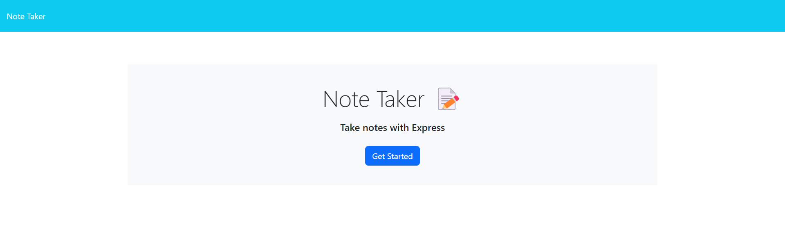
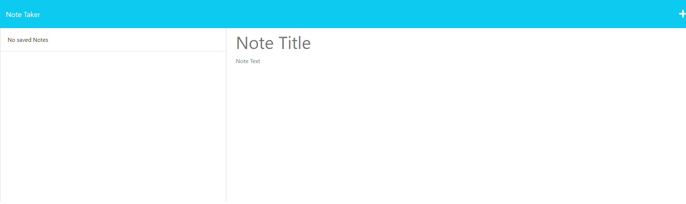

# Note Taking Application 

## Description

This application utilizes the npm package Express.js to assist the user with creating, saving, and deleting notes that the user may need to use on a daily basis.

## Table of Contents

[Description](#Description)    
[Usage](#Usage)     
[Contributing](#Contributing)     
[License](#License)     
[Screenshot](#Screenshot)     
[GitHub-Repository](#GitHub-Repository)         

## Usage
In order to use this application, please right click on server.js, and select the option 'Open in Integrated Terminal'.  Once the terminal is open in your VS Code, please type in the following commands:       

* npm i
* node server.js          

Once both the npm has been installed, as well as the server is running, please type into your browser: localhost:3001. You will be presented with a page with a button that can be clicked that is labelled at Get Started.            
\n
Once you have clicked the Get Started button, you will be taken to the notes page where you will be able to add notes.  These notes will need a title, as well as a body.  Once the information is input, click the save icon at the top right of the page.  Once clicked, the note will populate on the left side of the page.    
\n
If you would like to delete a note, simply click on the small red trashcan icon next to the note that is stored on the left side of the page.     

## Contributing

* Mark Fullton of the GT bootcamp tutoring services.     

## License

No license was selected for this repository.     

## Screenshot

## Live Link
[Live-Link](http://localhost:3001/)

## GitHub Repository
[github](https://github.com/jjray84/Note-Taking-App)

